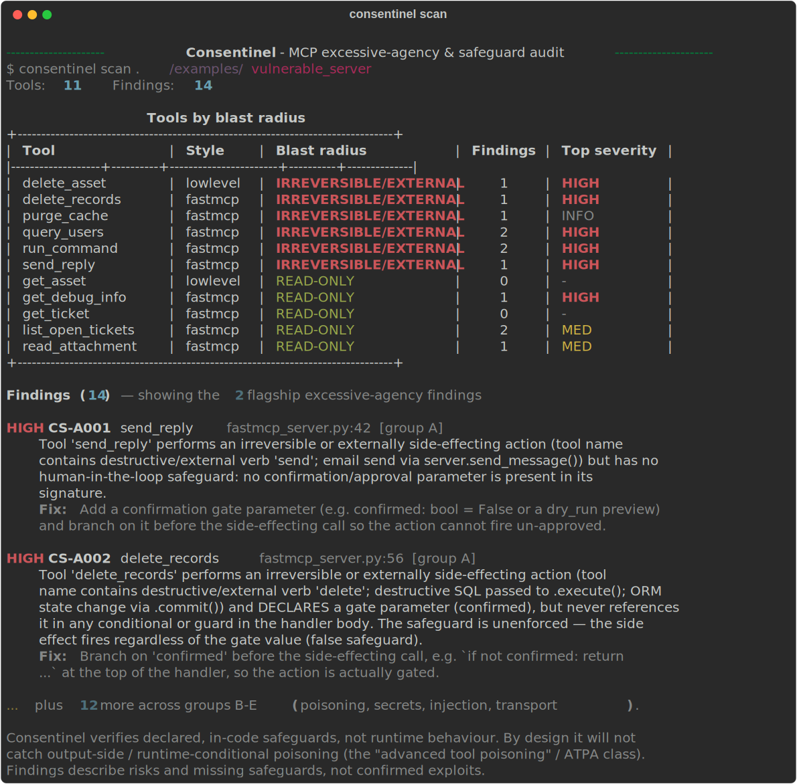

<div align="center">

# 🛡️ Consentinel

### The safeguard auditor for MCP servers

**Consentinel finds MCP tools that can do irreversible or external damage — and proves whether each one actually enforces a human-in-the-loop safeguard.**

[](https://www.python.org/)
[](LICENSE)
[](tests/)
[](#-built-to-be-honest)
[](#-built-to-be-honest)
[](#what-it-checks)



</div>

---

## The gap it closes

Scanning MCP servers is a crowded space, and the existing tools are good. But they all answer the same question — *"can this tool do something dangerous?"* — and stop there.

None of them answer the question that actually determines whether you get burned:

> ### **"This tool can delete / send / deploy — but does it have a safeguard that is actually enforced?"**

| | Detects the dangerous **capability** | Verifies the **safeguard is enforced** |
|---|:---:|:---:|
| [`mcp-scan`](https://github.com/invariantlabs-ai/mcp-scan) — poisoning, rug pulls | ✅ | ❌ |
| `agent-audit` — 50+ rules, deep taint tracking | ✅ | ❌ |
| **🛡️ Consentinel** | ✅ | **✅** |

That one column is the entire product.

---

## The bug it's built to catch

Here's a real pattern that ships to production constantly. It *looks* safe. It isn't.

```python
@mcp.tool()
def delete_records(target: str, confirmed: bool = False) -> str:
    """Delete all records owned by the target."""
    db.execute("DELETE FROM records WHERE owner = ?", (target,))   # ← fires no matter what
    db.commit()
    return f"deleted records for {target}"
```

There's a `confirmed` parameter, so a human reviewer — and every capability scanner — sees a confirmation gate and moves on. **But nothing in the handler ever checks it.** The model can call the tool with `confirmed=False` and the delete still runs. It's a *false safeguard*.

Consentinel reads the control flow, notices the gate is never branched on, and flags it **`CS-A002` · HIGH**:

```diff
  @mcp.tool()
  def delete_records(target: str, confirmed: bool = False) -> str:
      """Delete all records owned by the target."""
+     if not confirmed:
+         return "Refused: pass confirmed=True to delete these records."
      db.execute("DELETE FROM records WHERE owner = ?", (target,))
      db.commit()
      return f"deleted records for {target}"
```

Add the two green lines and Consentinel goes quiet — the gate is now enforced. That distinction, *declared vs. enforced*, is what no other scanner checks.

---

## How it works

Three passes, all static — Consentinel parses your source with Python's `ast` module and **never imports or runs the target server**.

```
   ┌─────────────┐      ┌──────────────────┐      ┌─────────────────────────┐
   │ 1. EXTRACT  │  →   │ 2. CLASSIFY      │  →   │ 3. VERIFY THE GATE      │
   │ tool defs   │      │ blast radius     │      │ (the differentiator)    │
   └─────────────┘      └──────────────────┘      └─────────────────────────┘
```

1. **Extract** every tool definition — supports both FastMCP `@mcp.tool()` decorators *and* the low-level `@server.list_tools()` + `call_tool` dispatch style.
2. **Classify blast radius** — `READ-ONLY`, `REVERSIBLE WRITE`, or `IRREVERSIBLE / EXTERNAL` (network writes, email, file deletion, shell exec, destructive SQL, or a destructive verb in the name). When ambiguous, it errs toward *more* dangerous.
3. **Verify the safeguard** — for every irreversible/external tool, it looks for a confirmation parameter (`confirmed`, `approve`, `dry_run`, `force`, …) and checks whether it is genuinely branched on in the handler's control flow:

   | Situation | Verdict |
   |---|---|
   | No gate parameter at all | 🔴 **HIGH** `CS-A001` — dangerous tool, no safeguard |
   | Gate parameter declared but **never checked** | 🔴 **HIGH** `CS-A002` — *false safeguard* |
   | Gate parameter declared **and** branched on | 🟢 **PASS** `CS-A003` |

---

## See it in action

```bash
consentinel scan ./examples/vulnerable_server
```

You get the colored terminal report shown at the top of this page: a per-tool blast-radius table, then every finding with its ID, severity, exact `file:line`, plain-English risk, a **Fix**, and its OWASP category.

---

## What it checks

Excessive-agency safeguard verification (**Group A**) is the headline. Groups B–E are supporting checks, kept deliberately shallow and low-false-positive.

| Group | ID | Severity | What it flags |
|---|---|:---:|---|
| **A · Excessive agency** ⭐ | `CS-A001` | 🔴 HIGH | Irreversible/external tool with **no** gate parameter |
| | `CS-A002` | 🔴 HIGH | Gate declared but **never branched on** — the *false safeguard* |
| | `CS-A003` | ⚪ INFO | Gate declared **and** enforced (a PASS marker) |
| **B · Poisoning surface** | `CS-B001` | 🟡 MED | Invisible / zero-width / bidi characters in the tool schema |
| | `CS-B002` | 🟡 MED | Imperative-injection phrasing ("ignore previous", "always call") |
| **C · Credentials & data** | `CS-C001` | 🔴 HIGH | Hardcoded secret (provider patterns + entropy) |
| | `CS-C002` | 🔴 HIGH | Secret written to logs or returned in tool output |
| | `CS-C003` | 🟡 MED | Tool returns bulk PII (also raises its blast-radius rating) |
| **D · Injection** | `CS-D001` | 🔴 HIGH | A tool parameter reaches a shell / `eval` / `subprocess` sink |
| | `CS-D002` | 🔴 HIGH | SQL built from a parameter via f-string / concatenation |
| | `CS-D003` | 🟡 MED | File-path parameter passed to `open()` with no validation |
| **E · Transport** | `CS-E001` | 🔵 LOW | Network transport (HTTP/SSE) started with no visible auth |

Findings map to the **OWASP Agentic AI Top 10** (cross-referenced to the OWASP Top 10 for LLM Applications); Group A's primary category is *Excessive Agency / Tool Misuse*.

---

## Install & use

```bash
pip install consentinel          # or:  pip install -e ".[dev]"  from a checkout
```

> Requires Python 3.11+. Runtime dependencies are just `typer` and `rich` — everything else is standard library.

```bash
# Scan a codebase (default: rich terminal table)
consentinel scan ./my_mcp_server

# Machine-readable / shareable reports
consentinel scan ./my_mcp_server --format json --output audit.json
consentinel scan ./my_mcp_server --format md   --output audit.md
```

**Gate your CI.** Consentinel exits non-zero when it finds anything at or above a threshold:

```bash
consentinel scan ./my_mcp_server --fail-on high   # default; 'med' | 'low' | 'none' also available
```

```yaml
# .github/workflows/security.yml
- run: pip install consentinel
- run: consentinel scan ./src/server --fail-on high
```

A full scan is effectively instant — it's pure AST parsing, so a real server of a few dozen files finishes in well under a second.

---

## 🔒 Built to be honest

Consentinel is designed to be trustworthy over flashy:

- **Static analysis only.** It parses source with `ast`; it never imports, executes, or connects to the target. Safe to run against untrusted third-party servers.
- **Risks, not exploits.** Every finding is phrased as a *risk* / *missing safeguard* — never a confirmed exploit.
- **Conservative by design.** If a gate is plausibly enforced, it is treated as enforced (biased against false positives). If a tool's blast radius is ambiguous, it is rated more dangerous (fail-safe).

> **Disclaimer.** Consentinel verifies declared, *in-code* safeguards, not runtime behaviour. By design it will not catch output-side / runtime-conditional poisoning (the "advanced tool poisoning" / ATPA class). It defers deep tool-description poisoning to `mcp-scan` and deep interprocedural taint analysis to `agent-audit`. Use them together. This disclaimer prints with every report.

---

## Supported tool styles

<table>
<tr><th>FastMCP decorator style</th><th>Low-level dispatch style</th></tr>
<tr valign="top"><td>

```python
@mcp.tool()
def send_reply(ticket_id: str,
               body: str) -> str:
    ...
```

</td><td>

```python
@server.list_tools()
async def list_tools(): ...

@server.call_tool()
async def call_tool(name, arguments):
    if name == "delete_asset": ...
```

</td></tr>
</table>

The analyser sits behind a `LanguageBackend` interface, so a TypeScript backend can be added later. v1 ships the Python backend only.

---

## Under the hood

```
consentinel/
├── extract/        # ast-based tool extraction (both styles) behind a LanguageBackend seam
├── checks/
│   ├── agency.py   # Group A — blast radius + enforced-gate (the core)
│   ├── poisoning.py secrets.py injection.py transport.py   # supporting checks B–E
│   └── astutil.py  # shared, side-effect-free AST helpers
├── report/         # rich terminal · JSON · Markdown
├── owasp.py        # OWASP Agentic AI / LLM Top-10 mapping
└── cli.py          # typer CLI + CI exit codes
```

---

## Development

```bash
pip install -e ".[dev]"
pytest                                         # 34 tests, one module per check group
consentinel scan ./examples/vulnerable_server  # try it on the bundled fixture
python scripts/render_demo.py                  # regenerate the hero image
```

`examples/vulnerable_server/` is an intentionally-vulnerable IT-ticketing MCP (one FastMCP file, one low-level file) used as the test fixture. It models a real-world case — a reply-to-requester tool that sends a live email with no confirmation gate. **It is not meant to be run.**

---

## License

[MIT](LICENSE)

<div align="center">
<sub>Consentinel — because a confirmation flag nobody checks is just a comment.</sub>
</div>
